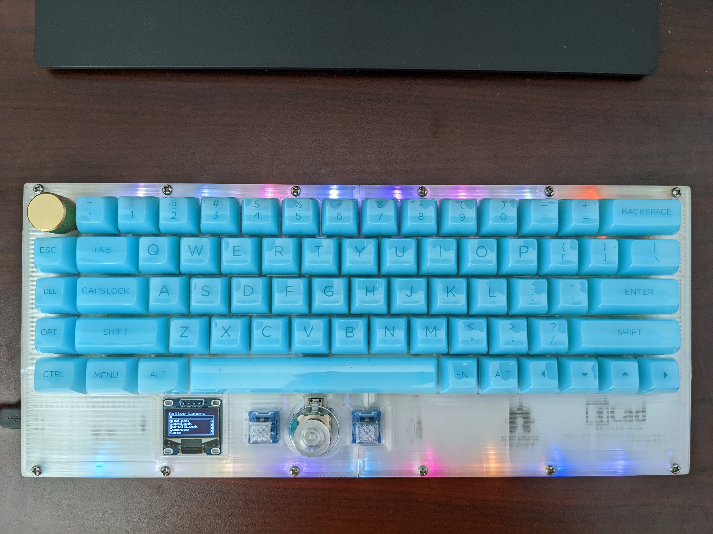
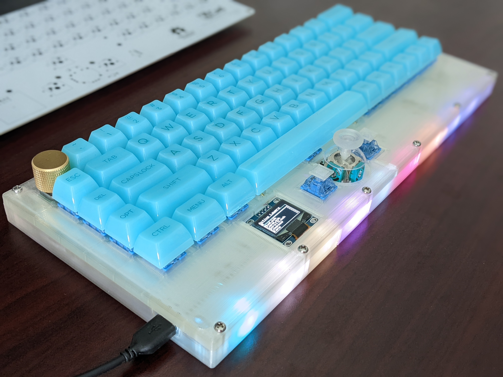
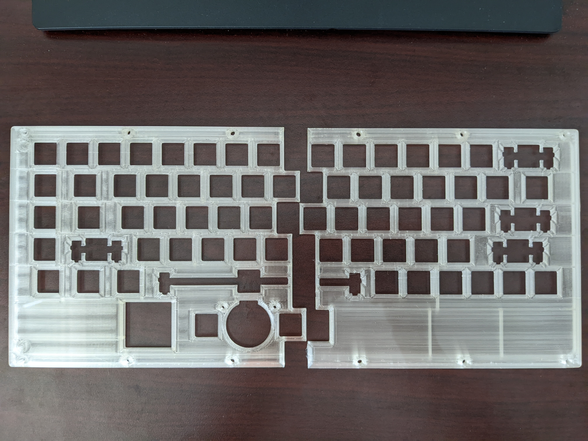
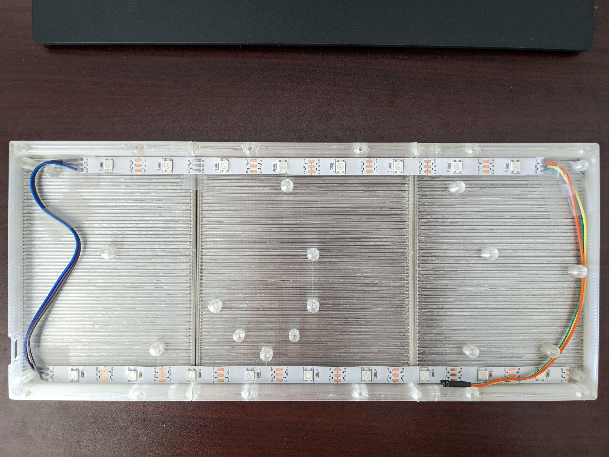
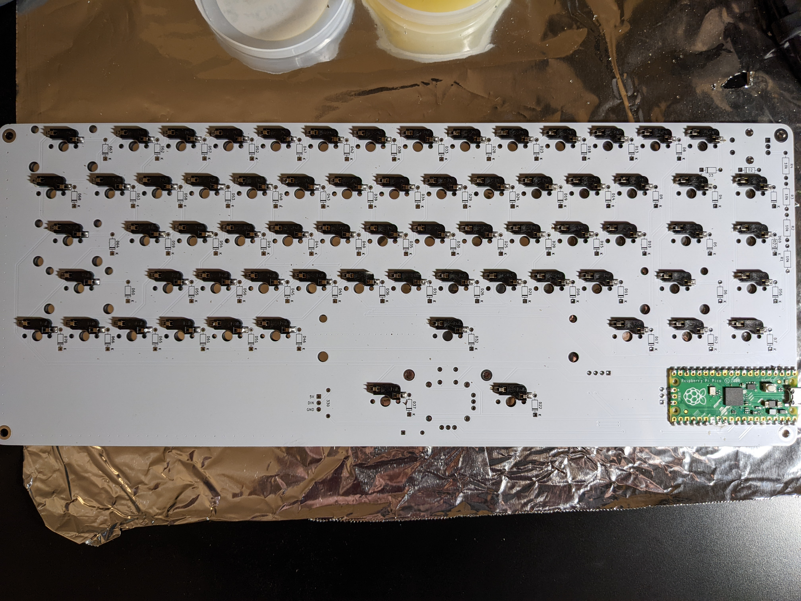

# Pico-Keyboard

A hot-swappable mechanical keyboard built from scratch with Pi Pico board, and 3D printed case.

# Pictures

## PCB

## Case

## Build Pictures

# Overall Cost Breakdown

In total per keyboard material cost is roughly $129.57

 * 5 PCB from JLCPCB with shipping: $39.52. Roughly $7.9 per board.
 * 100 hot-swappable PCB socket: $14.50. Used 68, so total $9.86.
 * Pi Pico: $4.99.
 * EC11 Rotary Encoder: $1.10 each.
 * COM-09032 Joystick: $4.50 each.
 * 100 1N4148 diodes: $4.99. Used 70 so $3.50.
 * 150 WS2812B: $14.49. Used 17, so total $1.64.
 * 3D printed case. Each part weight about 50g and there are 5 (2 for plate, and 3 for bottom). Total weight 250g roughly $6.
 * SSD1306 white color: $3 each.
 * GMMK encoder knob: $10.
 * Clear joystick knob: $5.
 * Stabilizers: $16.99 per set.
 * Akko clear translucent keycap: $39.99.
 * Akko blue switch: $9.99 per 45. Used 68, so total $15.10
 
# Build Instructions

## PCB
PCB is designed with KiCAD 6, and everything is under the [PCB](PCB/) folder. Pre-plotted files that can be uploaded to board factory are in 
`Gerber.zip` file. However, different factory may have different plotting settings, so it's recommended to replot with KiCad following factory's instruction. The provided one is for JLCPCB. 

## Case
Case is designed with Fusion 360. The file ends in `.f3z` contains the original Fusion 360 source. My build used SUNLU Clear PLA and is sliced with Cura. I put screw holes on the bottom to secure the PCB, but in practice it's not necessary to screw down the PCB once you've installed switches. So those are optional. The screws between plate and bottom are not optional however.

## Firmware
Firmware is in a separate repo: [PicoMK](https://github.com/zli117/PicoMK). Please see the instruction on how to configure and build the firmware there. 

# PCB Library Licenses

 * Pico symbol, footprint from https://github.com/ncarandini/KiCad-RP-Pico under CC-BY-SA 4.0. 3D model for Pico is obtained from Raspberry Pi Foundation.
 * COM-09032 symbol, footprint and 3D models are from SnapEDA.
 * Key switch footprints and 3D models are from https://github.com/perigoso/keyswitch-kicad-library 
 * Other symbols are from KiCad library which is under CC-BY-SA 4.0 license. 

This work is licensed under a
[Creative Commons Attribution-ShareAlike 4.0 International License][cc-by-sa].

[![CC BY-SA 4.0][cc-by-sa-image]][cc-by-sa]

[cc-by-sa]: http://creativecommons.org/licenses/by-sa/4.0/
[cc-by-sa-image]: https://licensebuttons.net/l/by-sa/4.0/88x31.png
[cc-by-sa-shield]: https://img.shields.io/badge/License-CC%20BY--SA%204.0-lightgrey.svg
